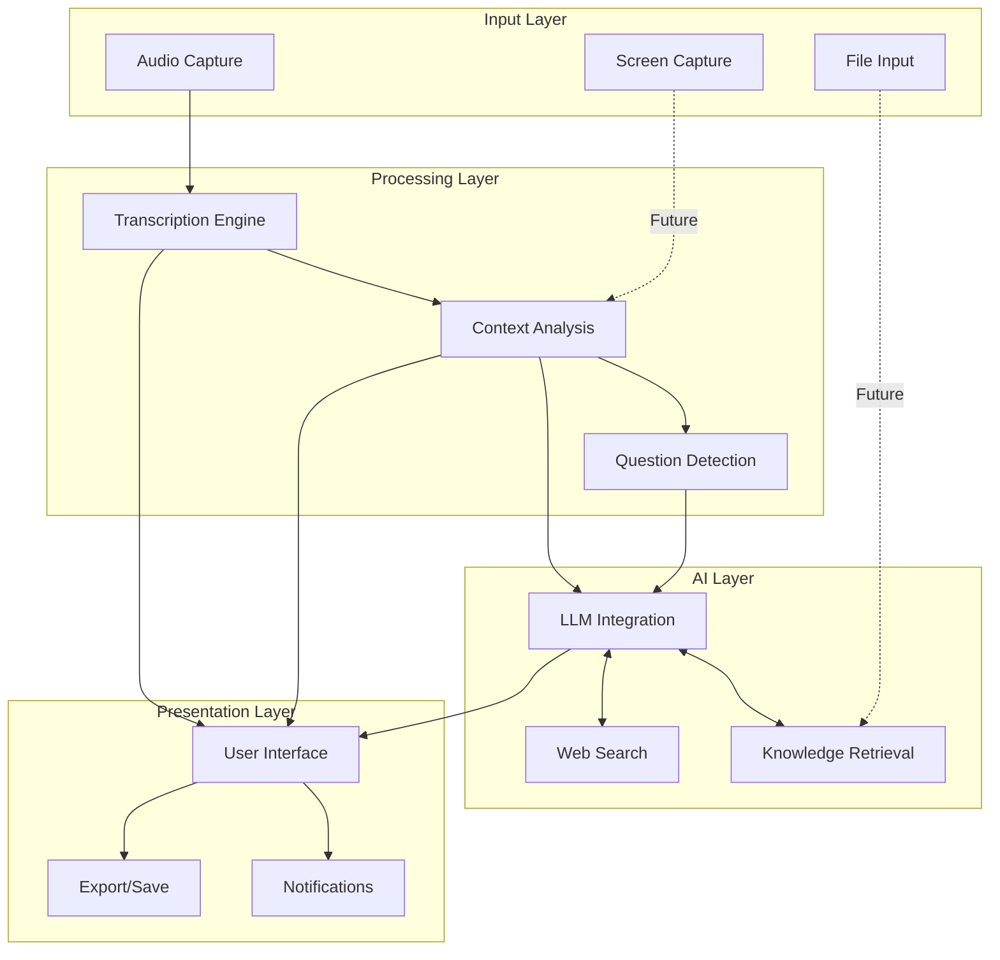

# AI Call Assistant (AICA)
# Product Requirements Document

**Document Status:** Draft  
**Version:** 0.1  
**Last Updated:** [Current Date]

## Table of Contents
1. [Executive Summary](#1-executive-summary)
2. [Product Vision](#2-product-vision)
3. [User Personas](#3-user-personas)
4. [User Journeys](#4-user-journeys)
5. [Functional Requirements](#5-functional-requirements)
6. [Non-Functional Requirements](#6-non-functional-requirements)
7. [User Interface](#7-user-interface)
8. [Technical Architecture](#8-technical-architecture)
9. [Privacy and Security](#9-privacy-and-security)
10. [Metrics and Analytics](#10-metrics-and-analytics)
11. [Development Roadmap](#11-development-roadmap)
12. [Go-to-Market Strategy](#12-go-to-market-strategy)
13. [Open Questions](#13-open-questions)
14. [Appendix](#14-appendix)

## 1. Executive Summary

AI Call Assistant (AICA) is a macOS application designed to enhance conversations and meetings by providing real-time AI assistance. AICA captures audio from both system output and microphone input, transcribes the conversation, and uses AI to generate contextually relevant information and answers to questions that arise during the conversation.

The application addresses the challenge of information access during live conversations, where interrupting the flow to look up information can disrupt the natural dialogue. By providing unobtrusive, real-time assistance, AICA helps users stay engaged in the conversation while having immediate access to helpful information.

Key features include real-time transcription, question detection, AI-powered responses, and a non-disruptive user interface. Future capabilities will include screen capture for visual context, web search integration, and file upload processing.

## 2. Product Vision

### Vision Statement
To transform how people participate in conversations by providing seamless, intelligent assistance that enhances communication without disruption.

### Mission
Empower users with real-time information access during calls and meetings, reducing cognitive load and enabling more meaningful, informed conversations.

### Core Value Proposition
AI Call Assistant bridges the gap between live conversation and information retrieval, providing relevant context and answers precisely when needed without disrupting the natural flow of dialogue.

### Strategic Alignment
This product addresses the growing need for intelligent assistance in a world where remote and hybrid meetings have become standard. It aligns with the trend toward AI augmentation of human activities and the need for tools that enhance productivity without adding complexity.

## 3. User Personas

### Primary Personas

#### Professional Meeting Participant (Alex)
- **Demographics:** 30-45 years old, knowledge worker
- **Technical Proficiency:** Moderate to high
- **Goals:**
  - Appear well-informed and prepared in meetings
  - Avoid asking basic questions that might diminish credibility
  - Save time on post-meeting research
- **Pain Points:**
  - Often struggles to recall specific details during discussions
  - Has to juggle note-taking with active participation
  - Misses opportunities to contribute due to information gaps
- **Usage Context:**
  - Client meetings
  - Team discussions
  - Industry conferences

#### Remote Worker (Jordan)
- **Demographics:** 25-35 years old, works primarily from home
- **Technical Proficiency:** High
- **Goals:**
  - Stay engaged in video calls despite potential distractions
  - Process information from multiple participants efficiently
  - Capture and retrieve meeting insights later
- **Pain Points:**
  - Finds it difficult to focus during long virtual meetings
  - Struggles with note-taking while actively participating
  - Misses nonverbal cues that might provide context
- **Usage Context:**
  - Daily standup meetings
  - Project planning sessions
  - Virtual workshops

#### Subject Matter Expert (Taylor)
- **Demographics:** 40-55 years old, specialized knowledge domain
- **Technical Proficiency:** Moderate
- **Goals:**
  - Provide accurate information in real-time
  - Fill knowledge gaps outside primary expertise area
  - Support statements with credible sources
- **Pain Points:**
  - Expected to know everything in their domain
  - Frequently asked questions outside core expertise
  - Limited ability to fact-check during live conversations
- **Usage Context:**
  - Client consultations
  - Training sessions
  - Expert panels

### Secondary Personas

#### Student (Riley)
- **Demographics:** 18-24 years old, university student
- **Technical Proficiency:** High
- **Usage Context:**
  - Virtual lectures
  - Study groups
  - Research interviews

#### Executive (Morgan)
- **Demographics:** 45-60 years old, senior leadership
- **Technical Proficiency:** Low to moderate
- **Usage Context:**
  - Board meetings
  - Investor calls
  - Strategic planning sessions

## 4. User Journeys

### Journey 1: First-Time Setup

1. **Discovery and Installation**
   - User learns about AICA through recommendation/marketing
   - Downloads application from website or Mac App Store
   - Installs application on macOS system

2. **Onboarding**
   - Launches application for the first time
   - Walks through permission setup (microphone, system audio)
   - Completes brief tutorial on core features
   - Configures basic preferences (UI position, notification style)

3. **Initial Use**
   - Enables AICA before first meeting
   - Observes real-time transcription
   - Receives first AI-generated insights
   - Reviews post-meeting summary

### Journey 2: Daily Usage (Professional)

1. **Pre-Meeting Preparation**
   - Launches AICA before scheduled call
   - Optionally loads relevant documents for context
   - Positions UI for optimal viewing during call

2. **During Meeting**
   - Participates in conversation naturally
   - Glances at AI-generated information as needed
   - Uses provided insights to enhance contributions
   - Occasionally saves valuable information for later

3. **Post-Meeting Review**
   - Reviews meeting transcript
   - Exports key insights and action items
   - Saves relevant information to knowledge base

### Journey 3: Problem Solving (Subject Matter Expert)

1. **Question Recognition**
   - During a call, a complex question is asked
   - User notices AICA has detected the question
   - AI begins generating a comprehensive response

2. **Answer Review**
   - User quickly scans AI-generated information
   - Evaluates accuracy and relevance
   - Incorporates insights into verbal response

3. **Follow-up Enhancement**
   - After providing initial answer, checks for additional context
   - Uses supplementary information to elaborate further
   - Saves response for future reference

## 5. Functional Requirements

### 5.1 Audio Capture

#### 5.1.1 System Audio Capture
- **Requirement:** AICA must capture all system audio output
- **Acceptance Criteria:**
  - Captures audio from all applications producing sound
  - Works with various call applications (Zoom, Teams, etc.)
  - Maintains audio quality without degradation
  - Does not interfere with normal audio playback

#### 5.1.2 Microphone Input Capture
- **Requirement:** AICA must capture the user's microphone input
- **Acceptance Criteria:**
  - Works with built-in and external microphones
  - Captures clear audio regardless of microphone quality
  - Does not interfere with microphone usage by other applications

#### 5.1.3 Audio Processing
- **Requirement:** AICA must process captured audio for optimal transcription
- **Acceptance Criteria:**
  - Filters background noise
  - Normalizes volume levels
  - Handles different audio formats and codecs
  - Processes audio in real-time with minimal latency

### 5.2 Transcription Engine

#### 5.2.1 Real-Time Transcription
- **Requirement:** AICA must convert speech to text in real-time
- **Acceptance Criteria:**
  - Transcription appears within 1 second of speech
  - Accuracy rate of at least 95% in ideal conditions
  - Graceful degradation in challenging audio environments
  - Continuous transcription for conversations of any length

#### 5.2.2 Speaker Diarization
- **Requirement:** AICA should distinguish between different speakers
- **Acceptance Criteria:**
  - Correctly attributes speech to different participants
  - Identifies when the user is speaking vs. others
  - Maintains speaker identification across the conversation
  - Allows manual correction of speaker identification

#### 5.2.3 Transcript Management
- **Requirement:** AICA must maintain searchable transcript history
- **Acceptance Criteria:**
  - Stores complete conversation transcripts
  - Enables searching within current and past transcripts
  - Allows editing and annotation of transcripts
  - Supports export in multiple formats (TXT, PDF, DOCX)

### 5.3 AI Response Generation

#### 5.3.1 Question Detection
- **Requirement:** AICA must identify questions within the conversation
- **Acceptance Criteria:**
  - Recognizes direct questions from any participant
  - Identifies implied information needs
  - Distinguishes rhetorical questions from actual queries
  - Prioritizes questions based on relevance and complexity

#### 5.3.2 Context Analysis
- **Requirement:** AICA must understand the conversation context
- **Acceptance Criteria:**
  - Maintains awareness of conversation topic and flow
  - Considers previous exchanges for context
  - Identifies key topics and entities in discussion
  - Adapts to topic changes in real-time

#### 5.3.3 Response Generation
- **Requirement:** AICA must generate relevant, accurate responses
- **Acceptance Criteria:**
  - Provides concise, relevant answers to detected questions
  - Includes source references when appropriate
  - Adapts response complexity to conversation level
  - Generates responses within 3 seconds of question detection

#### 5.3.4 Information Enhancement
- **Requirement:** AICA should provide supplementary information
- **Acceptance Criteria:**
  - Offers relevant facts related to conversation topics
  - Suggests clarifications for potentially ambiguous terms
  - Provides definitions for specialized terminology
  - Highlights connections between discussed topics

### 5.4 User Interface

#### 5.4.1 Transcription Display
- **Requirement:** AICA must display the live transcription clearly
- **Acceptance Criteria:**
  - Shows real-time text with minimal delay
  - Clearly distinguishes between speakers
  - Highlights current speaker
  - Enables scrolling through conversation history

#### 5.4.2 AI Response Display
- **Requirement:** AICA must present AI-generated information clearly
- **Acceptance Criteria:**
  - Displays responses in a visually distinct format
  - Prioritizes most relevant information at the top
  - Provides expandable details for longer responses
  - Indicates confidence level for generated information

#### 5.4.3 UI Positioning and Control
- **Requirement:** AICA interface must be adjustable and unobtrusive
- **Acceptance Criteria:**
  - Allows repositioning on screen
  - Supports resizing of the interface
  - Provides collapsible/expandable views
  - Remembers user preferences for positioning

#### 5.4.4 Notification System
- **Requirement:** AICA must alert users to important information
- **Acceptance Criteria:**
  - Provides subtle notifications for new information
  - Allows customization of notification style
  - Prioritizes notifications based on relevance
  - Does not disrupt ongoing conversation

### 5.5 Data Management

#### 5.5.1 Conversation History
- **Requirement:** AICA must store conversation history securely
- **Acceptance Criteria:**
  - Saves transcripts with timestamps
  - Associates AI responses with relevant conversation segments
  - Enables organization by date, participant, or topic
  - Allows deletion of history based on user preference

#### 5.5.2 Export and Sharing
- **Requirement:** AICA must allow export of conversation data
- **Acceptance Criteria:**
  - Supports multiple export formats
  - Enables selective export of specific information
  - Provides sharing options for collaboration
  - Maintains privacy controls during export

#### 5.5.3 Settings and Preferences
- **Requirement:** AICA must allow customization of behavior
- **Acceptance Criteria:**
  - Provides comprehensive settings interface
  - Saves user preferences persistently
  - Allows import/export of settings
  - Supports profiles for different usage contexts

### 5.6 Future Capabilities (Phase 2)

#### 5.6.1 Screen Capture
- **Requirement:** AICA should capture and analyze screen content
- **Acceptance Criteria:**
  - Captures visual content from user's screen
  - Processes images to extract relevant information
  - Integrates visual context with conversation context
  - Respects privacy by allowing selective capture

#### 5.6.2 Web Search Integration
- **Requirement:** AICA should perform web searches for information
- **Acceptance Criteria:**
  - Conducts searches based on conversation needs
  - Retrieves relevant information from credible sources
  - Integrates search results into responses
  - Citations sources appropriately

#### 5.6.3 File Processing
- **Requirement:** AICA should analyze uploaded documents for context
- **Acceptance Criteria:**
  - Accepts various file formats (PDF, DOCX, etc.)
  - Extracts relevant information from documents
  - Uses document content to enhance responses
  - Manages uploaded files securely

## 6. Non-Functional Requirements

### 6.1 Performance

#### 6.1.1 Responsiveness
- **Requirement:** AICA must operate with minimal latency
- **Target:** 
  - Transcription delay < 1 second
  - Response generation < 3 seconds
  - UI interactions < 100ms

#### 6.1.2 Resource Usage
- **Requirement:** AICA must use system resources efficiently
- **Target:**
  - CPU usage < 20% on average
  - Memory usage < 500MB
  - Battery impact < 10% additional drain

#### 6.1.3 Reliability
- **Requirement:** AICA must function consistently without failures
- **Target:**
  - Uptime > 99.9%
  - Crash rate < 0.1%
  - Graceful recovery from any failures

### 6.2 Compatibility

#### 6.2.1 Operating System
- **Requirement:** AICA must run on macOS
- **Target:**
  - Compatible with macOS 11.0 (Big Sur) and newer
  - Optimized for Apple Silicon and Intel processors
  - Consistent experience across supported versions

#### 6.2.2 Application Compatibility
- **Requirement:** AICA must work with common communication applications
- **Target:**
  - Full compatibility with: Zoom, Microsoft Teams, Google Meet, Slack, Webex
  - Basic compatibility with all audio-producing applications

#### 6.2.3 Hardware Compatibility
- **Requirement:** AICA must function on various Mac hardware
- **Target:**
  - Works on MacBook Air, MacBook Pro, iMac, Mac mini, Mac Studio, Mac Pro
  - Adapts to available hardware resources
  - Supports both built-in and external audio devices

### 6.3 Security

#### 6.3.1 Data Encryption
- **Requirement:** AICA must encrypt sensitive data
- **Target:**
  - All stored transcripts and settings encrypted at rest
  - All data transmissions encrypted in transit
  - Industry-standard encryption protocols (AES-256)

#### 6.3.2 Authentication
- **Requirement:** AICA must authenticate users securely
- **Target:**
  - Secure login mechanisms
  - Optional biometric authentication
  - Session management with automatic timeouts

#### 6.3.3 Privacy Controls
- **Requirement:** AICA must provide granular privacy settings
- **Target:**
  - User control over data collection
  - Clear data retention policies
  - Option for full local processing

### 6.4 Usability

#### 6.4.1 Learnability
- **Requirement:** AICA must be intuitive for new users
- **Target:**
  - First-time users accomplish core tasks without guidance
  - Comprehensive but unobtrusive onboarding
  - Contextual help available throughout the application

#### 6.4.2 Efficiency
- **Requirement:** AICA must support efficient workflows
- **Target:**
  - Minimal clicks for common actions
  - Keyboard shortcuts for all functions
  - Streamlined information presentation

#### 6.4.3 Accessibility
- **Requirement:** AICA must be accessible to users with disabilities
- **Target:**
  - Full compliance with WCAG 2.1 AA standards
  - Screen reader compatibility
  - Adjustable text sizes and color contrasts

### 6.5 Scalability

#### 6.5.1 User Data Growth
- **Requirement:** AICA must handle increasing user data efficiently
- **Target:**
  - Performance maintained with 1000+ hours of transcript history
  - Efficient storage utilization with compression
  - Background archiving of older conversations

#### 6.5.2 Feature Expansion
- **Requirement:** AICA architecture must support future capabilities
- **Target:**
  - Modular design for feature additions
  - Extensible API for integrations
  - Backward compatibility with earlier data formats

## 7. User Interface

### 7.1 Interface Principles

- **Unobtrusive**: The interface should not distract from the primary conversation
- **Glanceable**: Information should be digestible at a quick look
- **Adaptive**: UI should adjust based on available screen space and user needs
- **Consistent**: Visual language should be consistent throughout the application
- **Responsive**: Interface should feel immediate and responsive to user actions

### 7.2 Key Screens and Components

#### 7.2.1 Main Conversation Window
- Real-time transcription display with speaker identification
- AI response panel with expandable sections
- Quick action toolbar for common functions
- Status indicators for system components

#### 7.2.2 Settings Interface
- Organized, tabbed interface for all settings
- Visual feedback for setting changes
- Search functionality for finding specific settings
- Profile management for different use cases

#### 7.2.3 History and Search
- Calendar-based navigation of conversation history
- Full-text search with filters and sorting
- Preview of conversation segments
- Export and sharing options

#### 7.2.4 Notification System
- Subtle visual indicators for new information
- Priority-based notification hierarchy
- Customizable appearance and behavior
- Do-not-disturb mode integration

### 7.3 Initial Wireframes

*[Placeholder for wireframe images]*

1. Main application interface
2. Settings panel
3. History view
4. Notification examples

### 7.4 Visual Design Guidelines

- **Color Palette**: 
  - Primary: [TBD]
  - Secondary: [TBD]
  - Accent: [TBD]
  - Neutral: [TBD]
  
- **Typography**:
  - Primary Font: [TBD]
  - UI Size Range: 12px - 18px
  - Heading Hierarchy: H1-H4
  
- **Iconography**:
  - Consistent icon style throughout
  - Clear meaning without labels where possible
  - Accessibility considerations for all icons

## 8. Technical Architecture

### 8.1 System Components

### 8.2 Technology Stack

- **Application Framework**: Electron, React, TypeScript
- **Audio Processing**: macOS Core Audio, WebAudio API
- **Transcription**: Whisper API (cloud), Whisper.cpp (local)
- **AI Integration**: OpenRouter for LLM access
- **Storage**: SQLite for local data

### 8.3 APIs and Integrations

- **OpenRouter API**: For accessing various LLM models
- **Whisper API**: For cloud-based transcription
- **macOS Core Audio API**: For system audio capture
- **Future**: Web search APIs, document processing libraries

### 8.4 Data Flow

- **Audio Capture → Transcription**: Raw audio converted to text
- **Transcription → Context Analysis**: Text analyzed for meaning
- **Context → Question Detection**: Identifying information needs
- **Context/Questions → LLM**: Generating appropriate responses
- **LLM → User Interface**: Presenting information to user

### 8.5 Storage Schema

- **Conversations**: Transcripts with metadata
- **Responses**: AI-generated content linked to conversation segments
- **Settings**: User preferences and configurations
- **User Data**: Optional user information and profiles

## 9. Privacy and Security

### 9.1 Data Collection and Usage

- **Audio Data**: Processed for transcription, not stored in raw form
- **Transcripts**: Stored locally by default
- **Usage Patterns**: Anonymous usage statistics (optional)
- **User Settings**: Stored locally, synced to account if enabled

### 9.2 Data Storage Locations

- **Local Storage**: Primary storage on user's device
- **Optional Cloud Sync**: For multi-device usage
- **Processing Data**: Temporary cloud processing with immediate deletion

### 9.3 Security Measures

- **Encryption**: AES-256 for stored data
- **Authentication**: Secure account access if cloud features used
- **Transmission**: TLS 1.3 for all network communications
- **API Security**: Secure key management for third-party services

### 9.4 User Controls

- **Deletion Rights**: Ability to delete all stored data
- **Processing Options**: Choice between local and cloud processing
- **Data Retention**: Configurable retention periods
- **Recording Control**: Ability to pause/resume recording anytime

### 9.5 Compliance

- **GDPR**: Full compliance with deletion and data portability
- **CCPA**: California privacy requirements met
- **Industry Standards**: SOC 2 compliance for cloud components

## 10. Metrics and Analytics

### 10.1 Success Metrics

- **User Engagement**: Daily/weekly active users
- **Feature Usage**: Utilization of key features
- **Conversation Enhancement**: User-reported value added to conversations
- **Retention**: 30-day and 90-day retention rates

### 10.2 Performance Metrics

- **Transcription Accuracy**: Word error rate (WER)
- **Response Relevance**: User-rated response quality
- **System Performance**: CPU/memory usage, battery impact
- **Response Time**: Latency for various operations

### 10.3 Analytics Implementation

- **Anonymous Usage Data**: Basic feature usage tracking
- **Performance Monitoring**: System resource utilization
- **Error Tracking**: Crash and error reporting
- **User Feedback**: In-app feedback mechanisms

### 10.4 Data-Driven Improvements

- **Transcription Quality**: Continuous improvement based on error patterns
- **Response Optimization**: Refinement based on user interactions
- **UX Enhancements**: Workflow improvements based on usage patterns
- **Feature Prioritization**: Development focus based on user engagement

## 11. Development Roadmap

### 11.1 Phase 1: Foundation (2-3 months)

- Core audio capture implementation
- Basic transcription pipeline
- Simple UI with real-time display
- Local storage of transcripts
- Initial settings and preferences

### 11.2 Phase 2: Core AI Features (2-3 months)

- OpenRouter LLM integration
- Question detection and response generation
- Context analysis improvements
- Enhanced UI with response display
- Basic history and search capabilities

### 11.3 Phase 3: Refinement (1-2 months)

- Performance optimization
- UI/UX improvements
- Extended settings and customization
- Improved transcription accuracy
- Basic export and sharing features

### 11.4 Phase 4: Extended Capabilities (3-4 months)

- Screen capture integration
- Web search functionality
- Document upload and processing
- Advanced notification system
- Comprehensive export options

### 11.5 Future Considerations

- Mobile companion app
- Team collaboration features
- Integration with productivity tools
- API for third-party extensions
- Specialized versions for different use cases

## 12. Go-to-Market Strategy

### 12.1 Target Market

- **Primary**: Professional knowledge workers
- **Secondary**: Students and educators
- **Tertiary**: Personal users for everyday calls

### 12.2 Pricing Strategy

- **Freemium Model**:
  - Free tier with basic transcription and limited AI features
  - Pro tier ($9.99/month) with full AI capabilities
  - Team tier ($7.99/user/month) for collaborative features

### 12.3 Distribution Channels

- **Mac App Store**: Primary distribution channel
- **Direct Website**: Alternative download option
- **Enterprise Distribution**: For business customers

### 12.4 Marketing Approach

- **Content Marketing**: Focus on productivity enhancement
- **Social Media**: Targeted at professional audiences
- **Partnerships**: Integration with popular meeting platforms
- **User Testimonials**: Highlighting real-world benefits

## 13. Open Questions

### 13.1 Technical Questions

1. What is the most reliable method for capturing system audio on macOS?
2. How can we optimize the balance between transcription accuracy and latency?
3. What is the optimal approach for speaker diarization in various environments?
4. How should we manage API costs for LLM and transcription services?

### 13.2 Product Questions

1. What is the optimal UI layout for different use cases (meetings vs. interviews)?
2. How much control should users have over the AI's behavior?
3. What privacy controls will best address user concerns?
4. How can we measure and demonstrate the product's value to users?

### 13.3 Market Questions

1. What pricing structure will optimize both adoption and revenue?
2. Which user segments should we prioritize for initial marketing?
3. What partnerships could accelerate adoption?
4. How should we position the product relative to existing transcription tools?

## 14. Appendix

### 14.1 Research Findings

*[Placeholder for research summary]*

### 14.2 Competitive Analysis

*[Placeholder for competitive landscape overview]*

### 14.3 Technical Prototypes

*[Placeholder for technical proof-of-concept results]*

### 14.4 User Research

*[Placeholder for user interview summaries]* 