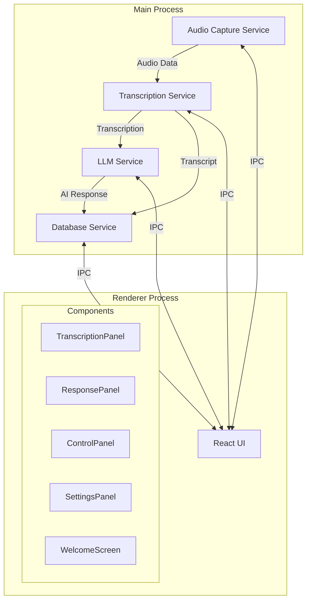
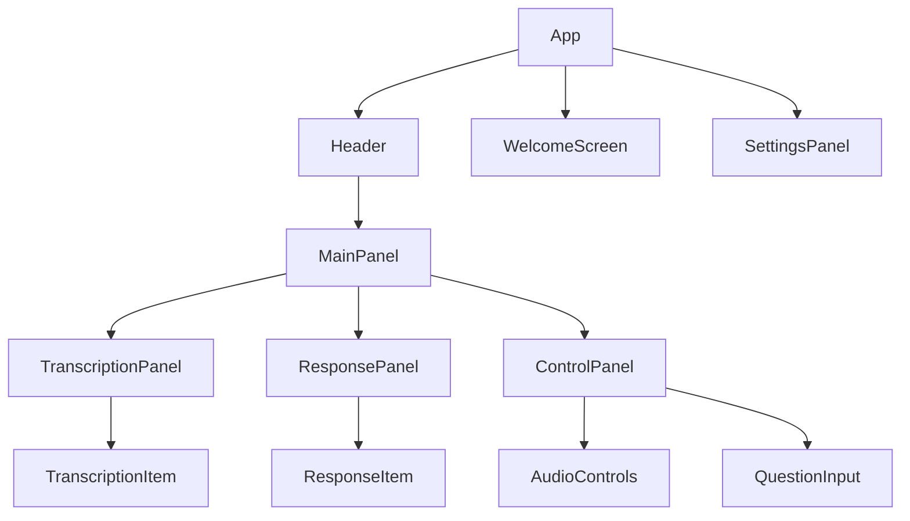
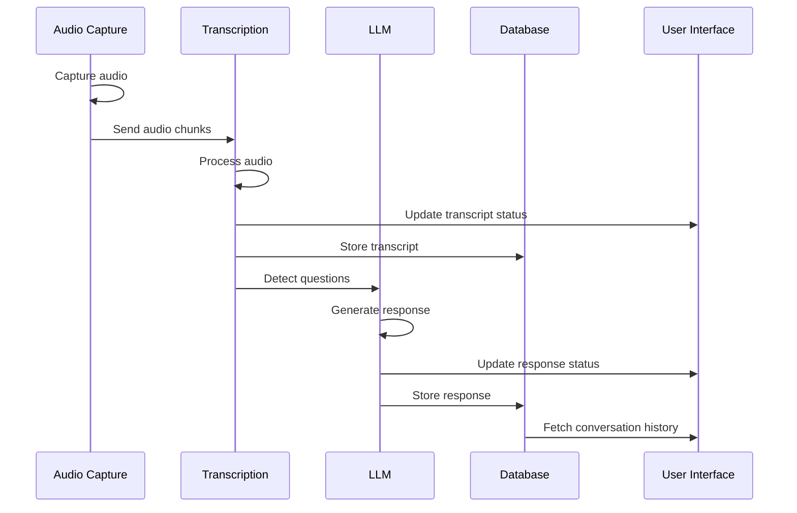
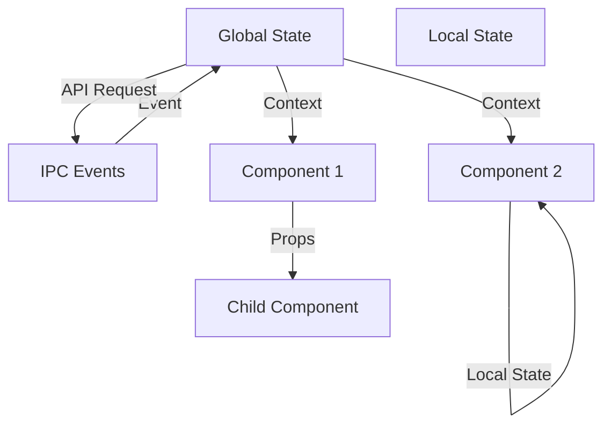
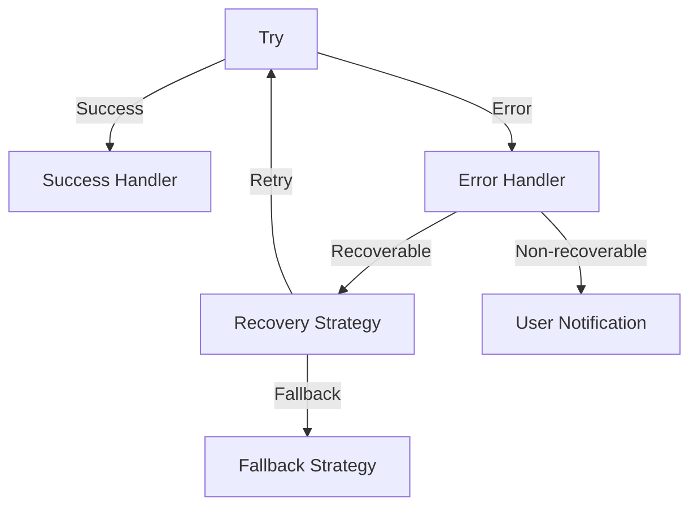

# System Patterns - AI Call Assistant

## Overall Architecture

The AI Call Assistant follows an Electron-based architecture with a clear separation between backend services (main process) and frontend UI (renderer process).

## Service Architecture

### Audio Capture Service
- Handles system audio and microphone input capture
- Uses buffer management for audio processing
- Transforms audio data for transcription

### Transcription Service
- Processes audio chunks from audio capture service
- Streams audio to OpenAI Whisper API (planned)
- Returns real-time transcription results
- Maintains conversation context

### LLM Service
- Takes transcribed text and generates AI responses
- Connects to OpenRouter for model flexibility (planned)
- Manages conversation context for relevant responses
- Handles rate limiting and API error recovery

### Database Service
- Stores conversations and transcriptions
- Manages user settings and preferences
- Provides export functionality
- Uses SQLite for local storage

## Component Architecture

### Component Responsibilities

- **App**: Main container, manages routing and global state
- **Header**: App branding, navigation, settings access
- **MainPanel**: Layout container for the main UI components
- **TranscriptionPanel**: Displays conversation transcripts
- **ResponsePanel**: Shows AI responses to questions
- **ControlPanel**: Provides audio control and manual question input
- **SettingsPanel**: Configuration UI for application settings
- **WelcomeScreen**: Onboarding experience for first-time users

## Data Flow

## State Management

The application uses a combination of:
- React Context API for global state
- Local component state for UI-specific state
- IPC communication for service-UI state synchronization

## Error Handling Pattern

1. Service-level error handling for API and system errors
2. Component-level error boundaries for UI failures
3. Global error logging and reporting
4. User-friendly error messages with recovery options where possible

## Configuration Management

Settings are stored in a hierarchical structure:
- System settings (audio devices, themes)
- User preferences (UI layout, notifications)
- API configuration (keys, endpoints)
- Privacy settings (data retention, recording preferences)

## Security Patterns

- API keys are securely stored using system keychain
- Local data is stored in user-specific directories
- IPC calls are validated to prevent unauthorized access
- Content Security Policy restricts external resources

## Testing Strategy

1. **Unit Tests**: Individual service and component testing
2. **Integration Tests**: Service-to-service and component interaction testing
3. **E2E Tests**: Full application workflow testing

## Deployment

- Packaged as a macOS application (.app)
- Auto-update mechanism for version management
- Installation flow handles permissions and dependencies 