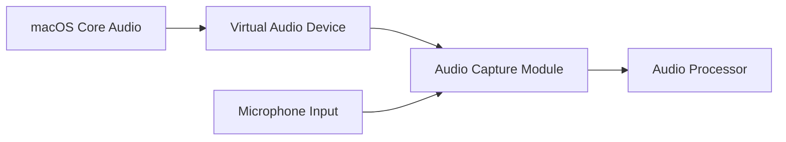
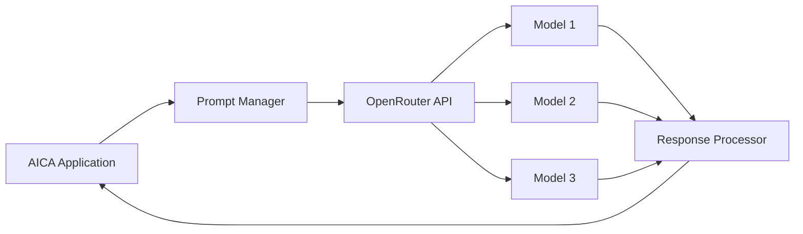
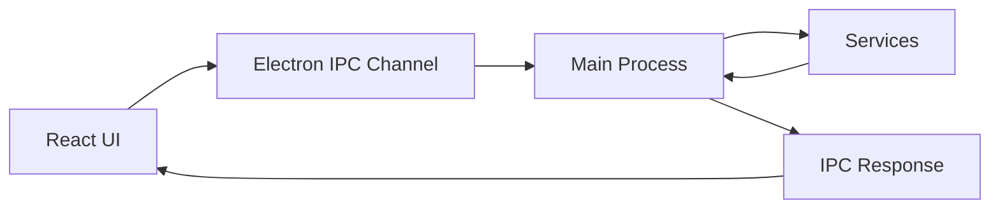

# Technical Context: AI Call Assistant (AICA)

## Technology Stack

### Core Application Framework
- **Electron**: Provides cross-platform desktop application capabilities while leveraging web technologies
- **React**: For building the user interface components with efficient rendering
- **TypeScript**: Ensures type safety and better development experience
- **Vite**: Fast modern bundler for efficient development and production builds

### Audio Processing
- **WebAudio API**: For initial audio processing and analysis
- **MacOS Core Audio**: For system-level audio capture
- **FFmpeg**: For audio format conversion and preprocessing

### Transcription Engine
- **Whisper API (OpenAI)**: For high-accuracy cloud-based transcription
- **Whisper.cpp**: For local, lightweight transcription capability (future implementation)
- **Custom speaker diarization module**: For distinguishing between speakers

### AI Integration
- **OpenRouter**: Primary gateway for accessing various LLM models
- **LangChain**: For building and managing LLM workflows (currently at v0.1.0)
- **OpenAI SDK**: For direct integration with OpenAI models (v4.24.0)

### Data Storage
- **SQLite3**: For local storage of conversation history and settings (v5.1.7)
- **Electron Store**: For persistent application configuration (v8.1.0)
- **Local file system**: For export/import of transcripts and settings

### Future Capabilities
- **Puppeteer/Playwright**: For web search automation
- **Document processors**: For handling uploaded files (PDF.js, docx.js)
- **Screen capture API**: For processing visual information

## Current Project Structure
```
ai-call-assistant/
├── src/
│   ├── main/          # Electron main process code
│   ├── renderer/      # React frontend code
│   └── common/        # Shared code and types
├── public/            # Static files
├── docs/              # Documentation
├── memory-bank/       # Project context and documentation
├── package.json       # Dependencies and scripts
├── tsconfig.json      # TypeScript configuration
└── vite.config.ts     # Vite bundler configuration
```

## Development Environment

### Required Tools
- Node.js v18+
- Yarn package manager (v4.6.0)
- XCode Command Line Tools
- macOS SDK access (for Core Audio integration)
- FFmpeg development libraries

### Development Workflow
1. Local development using Electron with hot reloading via Vite
   - `yarn dev` runs concurrent Vite and Electron processes
2. Component testing with Jest and React Testing Library
3. E2E testing with Playwright (future implementation)
4. CI pipeline for automated testing and building (future implementation)
5. Signed application packaging for macOS distribution with electron-builder

### Build and Run Process
- `yarn dev`: Development mode with hot reloading
- `yarn build`: Production build with TypeScript compilation and Vite bundling
- `yarn package`: Create distributable application using electron-builder
- `yarn start`: Run the built application
- `yarn lint`: Run ESLint for code quality checks
- `yarn test`: Run Jest tests

## Implementation Status

### Current State (MVP with Simulated Services)
- **Electron Shell**: Main and renderer process communication established
- **UI Components**: Basic framework with React components implemented
- **Simulated Services**: Audio capture, transcription, and LLM services currently simulated
- **Settings Persistence**: Using electron-store for configuration storage
- **User Onboarding**: Welcome screen and configuration flow implemented

### In Progress
- Replacing simulated services with real API connections
- Implementing actual Core Audio integration
- Connecting to OpenAI Whisper API for transcription
- Integrating with OpenRouter for LLM responses

## Technical Constraints

### Platform Limitations
- **macOS Audio Permissions**: Requires explicit user permission for audio capture
- **System Audio Capture**: Requires installation of a virtual audio device on some macOS versions
- **Application Sandboxing**: Requirements for Mac App Store distribution

### Performance Considerations
- **Real-time Transcription**: Requires efficient audio processing to minimize latency
- **Memory Management**: Need to manage conversation history without excessive memory usage
- **Battery Usage**: Minimize power consumption for laptop users

### API Limitations
- **OpenRouter Rate Limits**: Need to manage request frequency and token usage
- **Transcription API Costs**: Balance between cloud transcription quality and cost
- **Search API Limitations**: Rate limits and query restrictions

### Data Security
- **Conversation Privacy**: Need to ensure sensitive conversation data is securely handled
- **API Key Management**: Secure storage of API keys for various services
- **Local Storage Security**: Encryption for sensitive stored data

## Integration Points

### Audio Capture Integration


### OpenRouter Integration


### Electron IPC Communication Flow


## Development Roadmap Dependencies

### Phase 1: Core Audio & Transcription (Current)
- macOS audio capture capabilities
- Real-time transcription performance
- Basic UI implementation

### Phase 2: LLM Integration (Next)
- OpenRouter API configuration
- Prompt engineering optimization
- Response generation tuning

### Phase 3: Extended Capabilities (Future)
- Screen capture implementation
- Web search integration
- File upload processing

## Technical Risk Assessment

### High Risk Areas
1. **System Audio Capture**: Platform-specific challenges and permission requirements
2. **Transcription Accuracy**: Balancing speed vs accuracy in various environments
3. **LLM Response Relevance**: Ensuring generated responses are contextually appropriate

### Medium Risk Areas
1. **Performance Optimization**: Maintaining responsiveness with multiple processes
2. **Battery Usage**: Ensuring reasonable power consumption
3. **Cost Management**: Controlling API usage costs for transcription and LLM services

### Mitigation Strategies
1. **Early Prototyping**: Build POCs for high-risk components first
2. **Hybrid Processing**: Balance local vs cloud processing for critical functions
3. **Graceful Degradation**: Design system to work with reduced capabilities when needed
4. **Usage Monitoring**: Implement detailed tracking of API usage and costs

## Technical Decision Log

| Date       | Decision                        | Rationale                                       | Alternatives Considered             |
|------------|----------------------------------|------------------------------------------------|-------------------------------------|
| 2023-02-25 | Electron as application framework | Cross-platform capabilities with web tech       | Native macOS app, Web-only app     |
| 2023-02-25 | Vite for bundling               | Fast builds, hot module replacement             | Webpack, Parcel                     |
| 2023-02-25 | OpenRouter for LLM access        | Flexibility in model selection, fallback options | Direct API integration with specific models |
| 2023-02-25 | Hybrid transcription approach    | Balance between speed and accuracy              | Cloud-only or local-only approaches |
| 2023-02-25 | SQLite for local storage         | Lightweight, reliable, no external dependencies | IndexedDB, LevelDB, or file-based storage |

## Testing Strategy

### Unit Testing
- Component-level testing for UI elements with Jest
- Service-level testing for business logic
- Mock implementations for external services

### Integration Testing
- API integration testing with mock responses
- Audio processing pipeline testing
- Component interaction testing

### End-to-End Testing
- Full application workflow testing
- Performance benchmarking
- User scenario simulation

### Manual Testing Focus Areas
- Audio capture quality in various environments
- Transcription accuracy with different speakers
- LLM response quality for different conversation types 